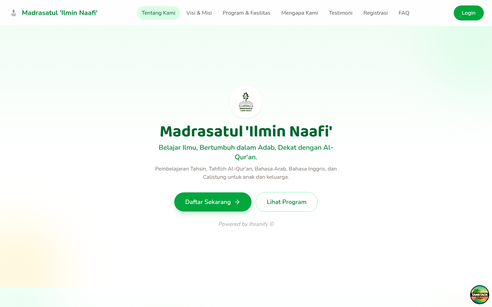
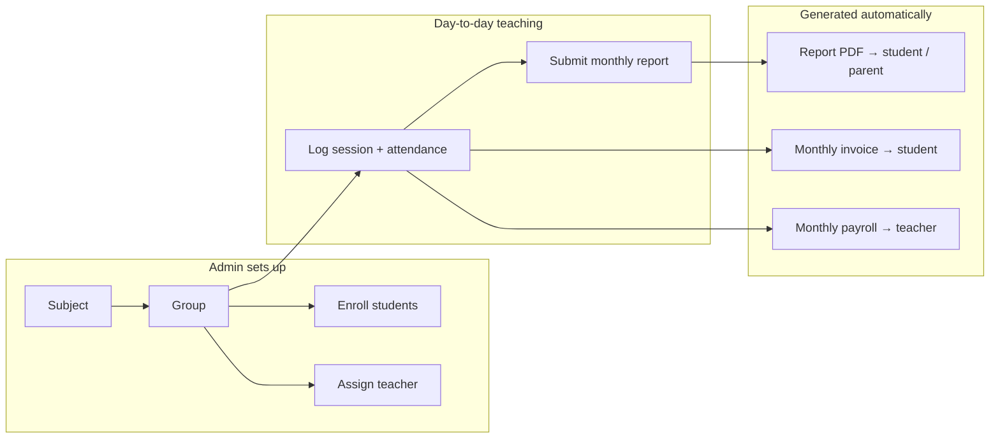
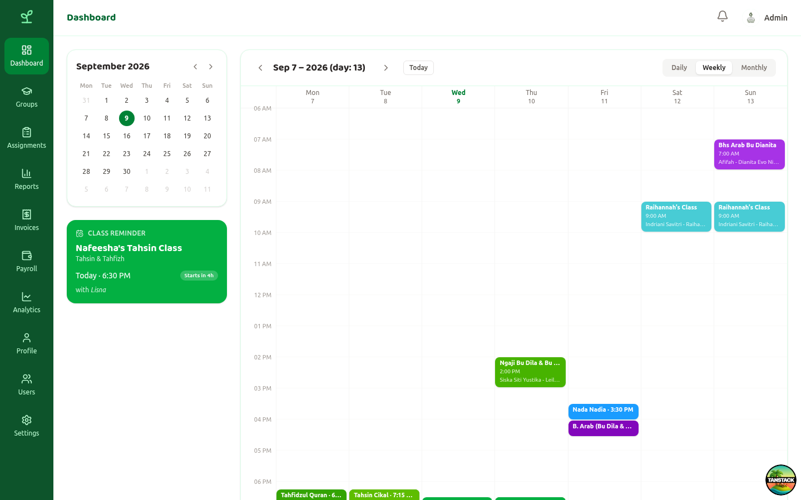
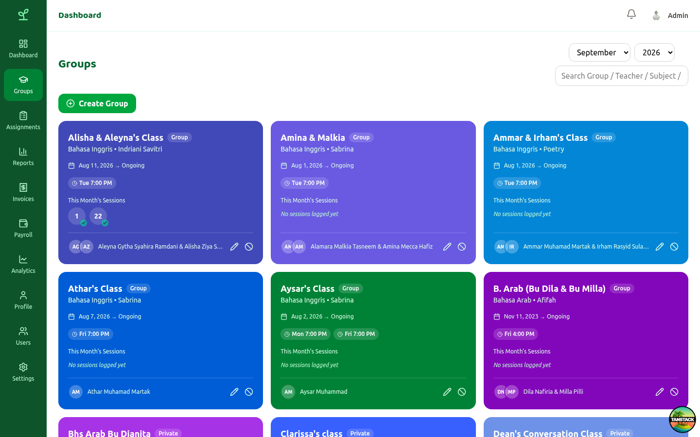

# Ihsanify

A lightweight, end-to-end Learning Management System built for a real online school running live classes — scheduling, attendance, monthly progress reports, invoicing, and teacher payroll, all in one place instead of coordinated ad hoc over WhatsApp and spreadsheets.

Built for [Madrasatul 'Ilmin Naafi'](https://ilminnaafi.com), an online Islamic learning center teaching Tahsin, Tahfizh, Bahasa Arab, Bahasa Inggris, and Calistung.



## Features

- **Groups & scheduling** — recurring weekly class schedules, group/private/semi-private class types, and a calendar view (daily/weekly/monthly) of every planned and logged session.
- **Attendance-backed session logging** — each real class meeting is logged against its group, with per-student attendance, feeding directly into billing and payroll.
- **Monthly progress reports** — per-student Progress/Advice/Score reports with a draft → submitted → read visibility gate (a report stays invisible to the student until the teacher explicitly submits it), exported as a branded PDF with mixed Arabic/Latin text support.
- **Invoicing & payroll** — auto-generated monthly student invoices (multi-group line items, bank details, sent-status tracking) and teacher payroll (per-group-type rates, per-student payslip line items), both with PDF export.
- **Role-based access** — Admin / Teacher / Student, enforced server-side on every endpoint, not just hidden in the UI.
- **Public landing page** — program info, testimonials, FAQ, and a WhatsApp-based registration flow for prospective families.
- **Online presence** — lightweight "last active" tracking surfaced as an online indicator on the user directory.

## How it works



A subject (e.g. Tahsin) contains groups; a group has one current teacher and a roster of enrolled students — both tracked as an audit log of assign/remove and join/leave events, not plain foreign keys, so a report for a past month always reflects who was actually enrolled *then*. Every logged session's attendance is the single source of truth that both invoicing and payroll are computed from.

## Screenshots

| Admin dashboard | Groups |
|---|---|
|  |  |

## Tech stack

| | |
|---|---|
| **Backend** (`apps/api`) | [Hono](https://hono.dev/) on Node, [Prisma](https://www.prisma.io/) + PostgreSQL, JWT auth, [`@react-pdf/renderer`](https://react-pdf.org/) for report/invoice/payslip PDFs |
| **Web app** (`apps/platform`) | [TanStack Start](https://tanstack.com/start) + [TanStack Router](https://tanstack.com/router), React 19, Tailwind CSS v4, Vite |
| **Mobile** (`apps/mobile`) | [Expo](https://expo.dev/) + Expo Router, React Native — early-stage, not yet wired to the API |
| **Tooling** | pnpm workspaces (monorepo), [Biome](https://biomejs.dev/) for lint/format, Husky pre-commit hooks, PM2 for process management in production |

## Monorepo structure

```
apps/
  api/       HonoJS backend — the single source of truth, used by every client
  platform/  Main web app — student/teacher/admin dashboard + the public landing page
  admin/     Scaffolded, not built out — all admin functionality currently lives in apps/platform
  mobile/    Expo/React Native app — early scaffolding stage
packages/
  ui/        Shared UI package (Tailwind build)
```

## Getting started

This is a pnpm monorepo (`pnpm@10.28.0`).

```bash
git clone https://github.com/ihsanify-app/lms.git
cd lms
pnpm install
```

### Environment

```bash
cp .env.example .env
```

Fill in `DATABASE_URL` and `JWT_SECRET` at minimum — see the comments in `.env.example` for what every variable does and which are optional.

### Database

The API needs PostgreSQL. `docker-compose.dev.yml` spins one up locally on port `5440`, matching the default `DATABASE_URL` in `.env.example`:

```bash
docker compose -f docker-compose.dev.yml up -d
```

Apply the schema and seed some demo data (teachers, students, groups, reports):

```bash
cd apps/api
pnpm db:migrate
pnpm db:seed
```

Seeded accounts all share the password `password123` (see `apps/api/prisma/seed.ts` for the full list of emails).

### Running

From the repo root:

```bash
pnpm api:dev        # HonoJS backend       → http://localhost:8000
pnpm platform:dev   # web app               → http://localhost:3000
pnpm admin:dev      # admin scaffold        → http://localhost:4000
pnpm dev            # api + platform + admin + ui, in parallel
```

For the mobile app:

```bash
cd apps/mobile
npx expo start
```

### Other scripts

```bash
pnpm lint           # biome check
pnpm lint:fix       # biome check --write
```

## License

MIT — see [LICENSE](LICENSE).
